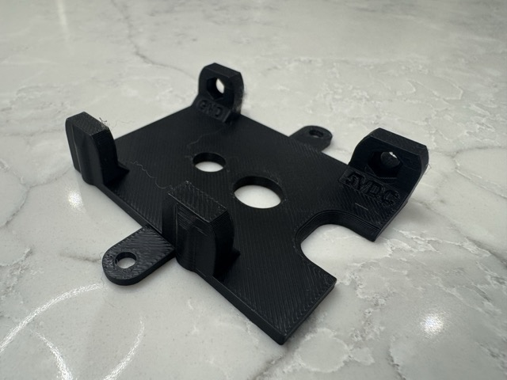
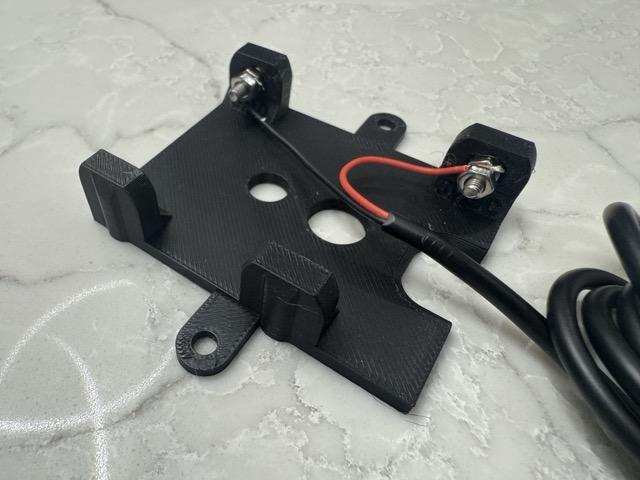

# Powering Furbies for Permanent Installations

If you are using a Furby in a permanent installation, such as an art piece or as a notification device, you may want to modify it to run continuously without the need for batteries. This guide provides instructions on how to power your Furby using an external power source.

> [!WARNING]  
> This modification involves opening up your Furby and may void any warranty. Proceed at your own risk. Though you should only be doing this on a 2016 Furby Connect model that you don't mind modifying and is well out of warranty already.

## Materials Needed

- Furby (2016 Connect model)
- 5V DC power supply (USB power adapter or similar)
- USB Pigtail Cable (with bare wires
- M3 screws and nuts

## 3D Printed Dummy Battery

The 2016 Furby connect has a battery compartment designed for 4 AA batteries inline.

> [!NOTE]  
> Modern Furbies have the battery compartment in a 3+1 stacked configuration so this dummy battery will not work for those models - this has only been tested with the 2016 Connect model.

To power the Furby externally, you will need to create a dummy battery that fits into the battery compartment and connects to the external power source.

Luckily, the Furby can run on 5V power with a peak draw of less than 1A - making it easy to power via USB or 5V DC power supply used for many lighting applications.

You can 3D print a dummy battery using the provided STL file: [furby-dummy-battery.stl](furby-dummy-battery.stl).

### Assembly Instructions

1. **Print the Dummy Battery**: Use a 3D printer to print the `furby-dummy-battery.stl` file.

2. **Prepare the USB Pigtail Cable**: Cut the USB pigtail cable to the desired length. Strip the outer insulation to expose the red (5V) and black (GND) wires.  You'll need around 2" / 5cm of the black outer sheath removed to work with the wires and then give yourself a good 1/2" / 1.5cm of stripped wire on each of the red and black wires.

3. **Add M3 Screws and Nuts**: Insert M3 screws into the designated holes on the dummy battery. Secure them with nuts on the inside.  You will use an additional M3 nut on each screw to clamp down the wires.

4. **Connect the Wires**: Place the stripped red wire (5V) under the screw on the positive terminal side of the dummy battery and tighten the screw to secure it. Repeat this for the black wire (GND) on the negative terminal side.  The red wire goes to the side of the dummy battery with the "5VDC" symbol, and the black wire goes to the side with the "GND" symbol. 

5. **Insert the Dummy Battery**: Place the dummy battery into the Furby's battery compartment, ensuring that the screws make proper contact with the terminals inside the compartment.  The hole for the wires exits by the tail of the Furby. Note that the dummy battery model also contains additional holes should you want to mount with screws for a more permanent installation (1/4" and 3/8" holes provided for standard camera or lighting stands).

6. **Connect to Power Supply**: Plug the USB end of the pigtail cable into a 5V DC power supply (such as a USB power adapter). Ensure that the power supply can provide at least 1A of current.

Now your Furby should power on and operate normally using the external power source!  Note that it takes around 10 seconds for the Furby to boot up after applying power.

